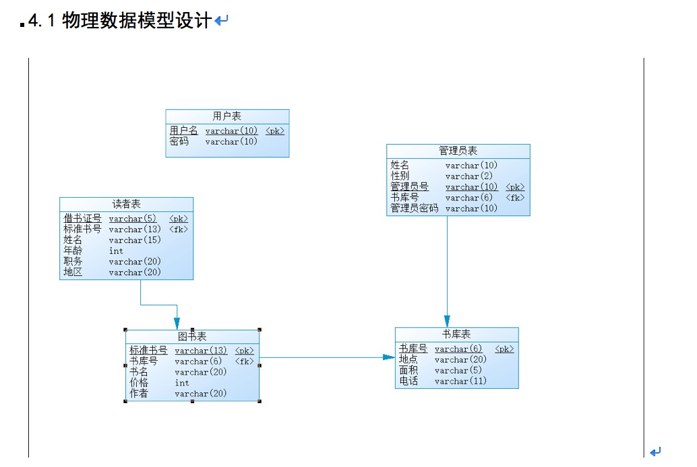

# Summery
### C# Windows form
##### 学生图书管理系统
#### Download
<pre><code>
git clone https://github.com/TypeInfos/c-Programe.git
</pre></code>
****
### 物理模型
写系统前先建数据库，我这是用powerdesigner，这个软件功能超级强大，并用动软生成代码，生成三成架构

### 具体界面
__这里示范的是查询图书的界面(肯定是有目的)__

#### 就以上面查询界面，举个栗子
假如有四条数据

* 福建闽侯
* 福建省福州市闽侯
* 福建鼓楼
* 福州市鼓楼

>我们输入福建闽侯,当我们用**like %string%**是只会显示第一条数据：

* 福建闽侯

但用户想要的是:

* __福建省福州市闽侯__
* __福建闽侯__

所以我的想法是输入查询字符对应的每个单字符都和结果相对比，用foreach获取字符相同时的字符数组下标，可以找到与 
__%福%州%闽%侯%__相同的数据，比如福州市闽侯，更为精准

#### 在TestReport里面具体讲了流程(sql文件也在里面)

